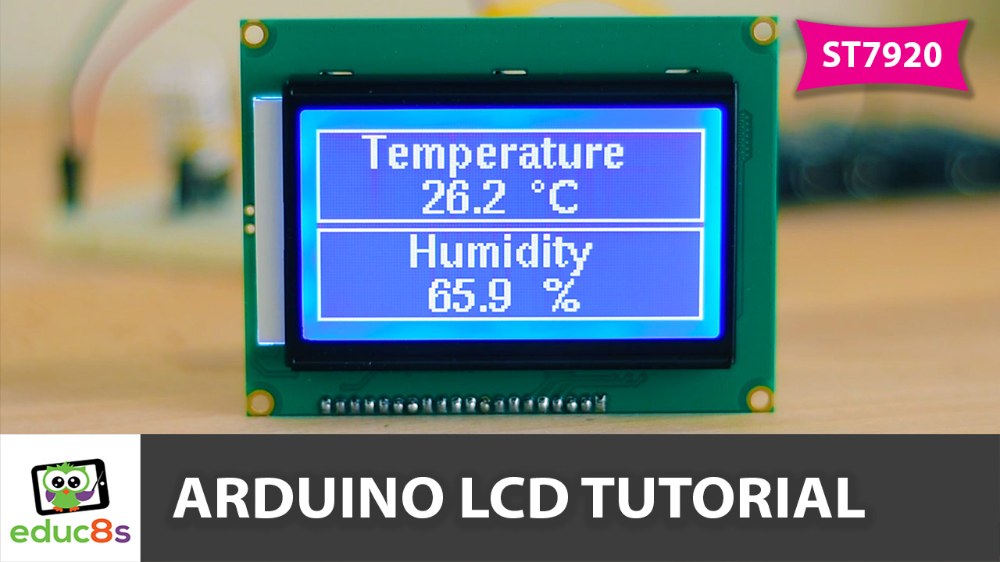
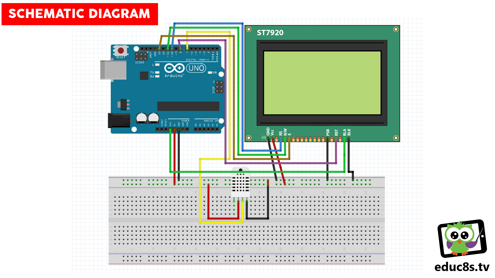

# Arduino-ST7920-Temperature-and-Humidity-Monitor
This is simple Arduino Temperature and Humidity monitor using a big ST7920 display and an Arduino Uno. 

  

# Watch the video here: https://www.youtube.com/watch?v=GsrugNJ2JXU

# Parts Needed
* Arduino Uno ▶ http://educ8s.tv/part/ArduinoUno
* DHT22 Sensor ▶ http://educ8s.tv/part/DHT22
* ST7920 LCD Display ▶ http://educ8s.tv/part/ST7920
* Breadboard ▶ http://educ8s.tv/part/SmallBreadboard
* Wires ▶ http://educ8s.tv/part/Wires

# Schematic

  

